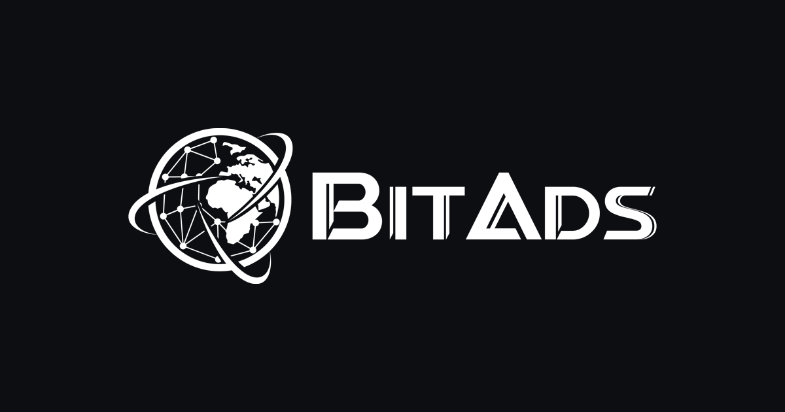
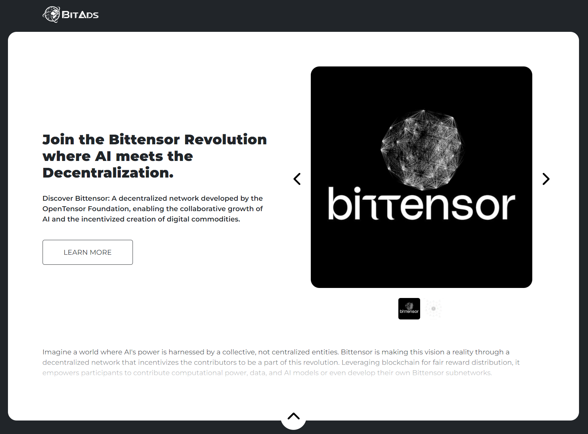

# BitAds - Decentralized Advertising on Bittensor

**Revolutionizing Online Advertising with Decentralization. Discover how BitAds leverages the Bittensor Network to offer cost-effective, high-quality advertising through a unique incentive mechanism for miners and validators.**



:no_entry_sign:**The Problem:**

The current advertising landscape, particularly as shaped by the web2 paradigm, presents significant challenges not only for the users who are subjected to ads but also for the companies that invest heavily in advertising. At the heart of these challenges are the highly centralized tech organizations that dominate and control the industry, such as Google AdSense, Facebook Audience Network, and Apple Advertising. This centralized control results in a significant power imbalance, lack of transparency, and high costs. 

:bulb:**The Solution:**

The BitAds network emerges as a revolutionary solution, harnessing the power of blockchain technology to foster a decentralized and incentivised advertising environment. By reimagining the foundational principles of advertising transactions, BitAds seeks to rectify the issues of transparency, fraud, inefficiency, and the high costs associated with conventional advertising methods.

:link:**Usefull Links:** <br>

Subnet Video Presentation: https://www.youtube.com/watch?v=5vJjnIrzMLk <br>
Whitepaper: https://bitads.ai/whitepaper <br>
Roadmap: https://bitads.ai/roadmap <br>
API Docs: https://bitads.ai/api <br>
GitHub: https://github.com/eseckft/BitAds.ai

# The BitAds.ai Ecosystem

**1. Validators, Miners, and BitAds Core:**

Validators create and manage advertising campaigns using the BitAds Core platform, which provides tools for creating landing pages and tracking campaign performance. <br><br>
Miners generate unique links for campaigns to promote across the internet. They are rewarded with TAO tokens for driving organic traffic to these links. BitAds Core acts as the central platform for campaign management, traffic analysis, and miner validation.

**2. Incentive Mechanism:**
Miners are incentivized with TAO tokens, not based on the client's payment offer, but on the organic traffic they attract. This system ensures cost-effective advertising for clients while rewarding miners substantially for their efforts.
<br>


# Integration with Bittensor

BitAds leverages Bittensor’s decentralized network to distribute advertising tasks among miners. <br><br>
Initially, BitAds will focus on promoting the Bittensor project itself, demonstrating the network's marketing capabilities and incentivizing participation. <br><br>
Taking into consideration the potential emission of the subnet, this will potentially serve as the most powerful marketing engine for the Bittensor project. <br><br>
By harnessing the collaborative efforts of the network's participants, BitAds aims to significantly enhance the visibility and adoption of Bittensor, establishing a robust foundation for the future growth of both BitAds and Bittensor.

# The First Incentivized Campaign
<br>
The first campaign ["Join the Bittensor Revolution where AI meets the Decentralization"](https://x.bitads.ai/lty9sdtvcg55s/) on the BitAds Network will be BittensorWiki, a platform where you can find everything you need to know about the Bittensor Network. <br>
In fact, this campaign will serve as a powerful marketing tool for the Bittensor Network, as miners will be incentivized to generate organic traffic for the BittensorWiki campaign. <br>
https://bittensorwiki.com

# FirstAds.ai - The First Web App
<p align="center">
  
</p>

The first application developed on the BitAds subnet is FirstAds. This platform enables users to create and promote their campaigns, incentivizing BitAds miners to generate organic traffic for these campaigns at a minimal cost. <br>
https://firstads.ai

# Advantages of BitAds.ai

:globe_with_meridians:**Decentralization** <br>
BitAds emphasizes optimal decentralization by ensuring a broad distribution of miners and validators.

:moneybag:**Cost-Effectiveness** <br>
By operating on low-cost systems requirements and incentivizing miners with TAO tokens, BitAds offers a highly economical advertising solution for both parties, clients and promoters.

:gem:**Quality Traffic** <br>
The incentive mechanism encourages miners to drive high-quality organic traffic to their links.

:star:**Miners Competition** <br>
Miners are motivated to outperform each other in attracting the best traffic to clients' websites, in order to generate more rewards. This competition enhances the effectiveness of advertising campaigns, ensuring that clients will receive optimal visibility and engagement.

# Income Sources for Validators
:white_check_mark:**Validators can monetize their participation in BitAds.ai Subnet through various avenues, including:** <br>
- promoting their own products <br>
- engaging in affiliate marketing (for example - Amazon Affiliate Program, ClickBank) <br>
- developing applications using the BitAds.ai API <br>
- offering paid API access to others

# Scoring Mechanism

The scoring formula for BitAds miners incorporates a thoughtful approach to quantifying the effectiveness and impact of miners based on two key performance indicators: Unique visits and Click-through rate (CTR).

:arrow_down:**Parameters and Normalization**

**Unique Visits (U)** <br>
This measures the total number of distinct visitors directed to the campaign via the miner's unique link. It's a direct indicator of the reach and traffic generated by the miner.

**Click-Through Rate (CTR)** <br>
Expressed as a decimal, this metric captures the efficiency of the campaign in engaging visitors. Specifically, it measures the proportion of visitors who click the "call to action" button and, if prompted, complete a captcha. A CTR of 5% is represented as 0.05, for example.

**Maximum Expected Values (Umax and CTRmax)** <br>
These thresholds are set to normalize the unique visits and CTR, ensuring they're scaled to a value between 0 and 1. This normalization facilitates a fair comparison between miners, accounting for varying scales of performance.  Let's say Umax is set to 1000, and CTRmax is 0.15.

Normalization is performed as follows:
```bash
Unorm = U / Umax
CTRnorm = CTR / CTRmax
```

**Weight of Parameters (Wu and Wc)** <br>
These weights reflect the relative importance of Unique visits and CTR in calculating the miner's score. By adjusting these weights, you can balance the emphasis on traffic generation versus engagement.<br> In our model, both parameters are equally valued, with Wu = 0.5 and Wc = 0.5.

**Score Calculation** <br>
The Miner Score is computed by applying the weights to the normalized values of unique visits and CTR, as follows:

```bash
MINER SCORE = (Wu * Unorm) + (Wc * CTRnorm)
```

Given the example of a miner with 1000 unique visitors and a CTR of 5% (0.05), and with the normalization constants provided (Umax = 1000, CTRmax = 0.15), the calculations would be:
```bash
Unorm = 1000 / 1000 = 1
CTRnorm = 0.05 / 0.15 = 0.333
```

Thus, the Miner Score would be:
```bash
MINER SCORE = (0.5 * 1) + (0.50 * 0.333) = 0.5 + 0.1665 = 0.6665
```

**Conditions and Adjustability:**

The formula caps the Miner Score at 1, ensuring scores remain within a 0 to 1 range. If the calculated score exceeds 1, it's adjusted to 1, maintaining a standardized scoring scale.

Both the maximum expected values (Umax, CTRmax) and the weights (Wu, Wc) are configurable through the admin panel of BitAds. <br> This flexibility allows you to recalibrate the scoring model based on evolving campaign goals, performance benchmarks, or engagement strategies.

# Subnet Security 

**BitAds campaigns have multiple levels of protection against fraudulent activity such as bot or script-driven fake activity. In particular, verification for human authenticity occurs through:**
- AWS WAF [(Well-Architected Framework) ](https://aws.amazon.com/waf/)
- CAPTCHA

All incoming requests are forwarded to AWS WAF for inspection by the web ACL. <br>

AWS WAF is a web security service that helps protect web applications from common web threats such as SQL injections, cross-site scripting (XSS), and cross-site request forgery (CSRF). <br>

Human Verification Check is an additional layer of protection in AWS WAF, designed to help distinguish humans from bots. It is useful for preventing automated attacks such as DDoS attacks and spam. 
In BitAds.ai architecture it is one of the levels of protection against traffic manipulation. <br>

Each time the BidAds.ai API is accessed, validators' and miners' scripts transmit their Bittensor wallet keys for verification of their presence in the registered users' database. BidAds also checks the status of each user (whether they are active or blocked), as well as the compatibility of validators' and miners' script code versions with the current version provided by BitAds.ai developers. This, on the one hand, requires users to constantly update their scripts and prevents unauthorized interference with them. <br>

Additionally, every 30 minutes, there is an update of the lists of allowed participants in the process. Miners receive a list of validators, and validators receive a list of miners with whom they can communicate. This way, the system is protected from external intrusion.

# Roadmap

1. **Template and Design Expansion** <br>
Add more templates, colors, and layouts to BitAds landing pages.

2. **Device Targeting** <br>
Implement device targeting feature to specify desired traffic source.

3. **Performance Analytics** <br>
Implement daily performance analytics for validators to enhance campaign monitoring.

4. **Geo-Location** <br>
Implement geo-location filtering to enable validators and clients to specify desired traffic origins in BitAds.

5. **Campaign Information Bot** <br>
Launch an interactive discord/telegram bot to provide miners with immediate access to campaign information and notifications.

6. **Traffic Source Analysis** <br>
Implement traffic source analysis to precisely track visitor origins.

7. **Domain Selection Expansion** <br>
Expand landing page domains to enable validators and clients to select from a wider range of options.

8. **Conversion Tracking** <br>
Integrate conversion tracking in order to measure conversion rates on client websites.

# Creating a Wallet

Before proceeding, you'll need to create a wallet. A wallet is required for managing your digital assets and interacting with the functionalities provided by this repository.

Detailed instructions on how to create a wallet can be found in the official documentation [here](https://docs.bittensor.com/getting-started/wallets).

Please ensure that you follow the steps outlined in the documentation carefully to set up your wallet correctly.

# Registration in Subnetwork

To fully utilize the functionalities provided by this repository, it is necessary to register within the BitAds.ai Subnetwork (UID 16). 
```bash
btcli subnet register --netuid 16 --wallet.name <name> --wallet.hotkey <name>
```

# Usage of Scripts

Please note that the usage of scripts within this repository is restricted to registered users of [BitAds.ai](https://BitAds.ai)

To utilize any scripts provided here, you must first sign up and authenticate yourself on the [BitAds.ai](https://BitAds.ai) platform. Once registered, you will be granted access to the necessary resources and functionalities. 

**The validators will be manually approved after we receive written confirmation on Discord about their registration.**

For any inquiries regarding script usage or registration, please refer to the official documentation on [BitAds.ai](https://BitAds.ai) or contact our support team.

# Installation Guide

To begin using this repository, the first step is to install Bittensor. Bittensor is a prerequisite for running the scripts and tools provided here. 

You can find detailed installation instructions for Bittensor in the official documentation [here](https://docs.bittensor.com/getting-started/installation).

Please make sure to follow the installation steps carefully to ensure that Bittensor is properly set up on your system before proceeding with any other operations.

If you encounter any issues during the installation process, refer to the troubleshooting section in the Bittensor documentation or reach out to our support team for assistance.

**Prerequisites:**
- Ensure that you have Python 3.12 or a later version installed on your system.**
- Run your local Subtensor

```basg 
git clone https://github.com/eseckft/BitAds.ai.git
cd BitAds.ai
python3 -m pip install -e .
python3 setup.py install_lib
python3 setup.py build
```

**After registration, you can start the miner script using the following command:**

```bash
python neurons/miner.py --netuid 16 --subtensor.network finney/local --wallet.name <name> --wallet.hotkey <name> --logging.debug --logging.trace
```

**And for running the validator script, use:**

```bash
python neurons/validator.py --netuid 16 --subtensor.network finney/local --wallet.name <name> --wallet.hotkey <name> --logging.debug --logging.trace
```
