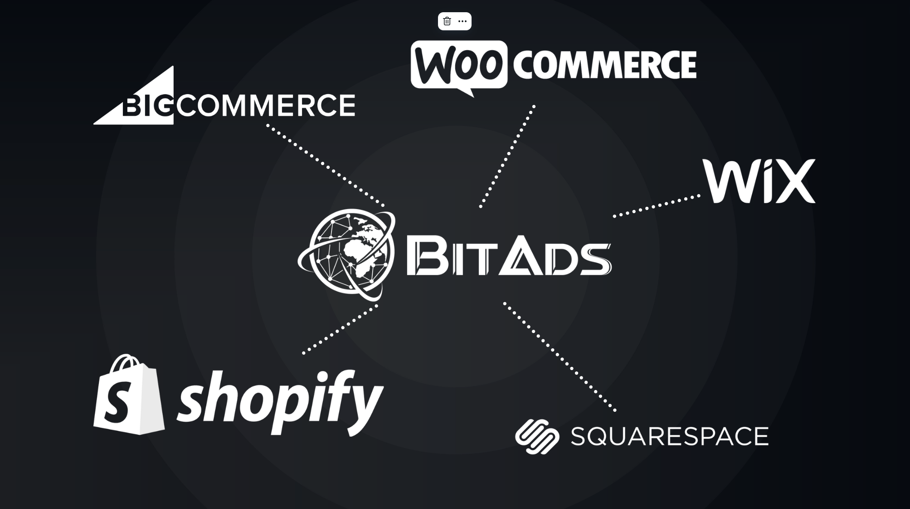
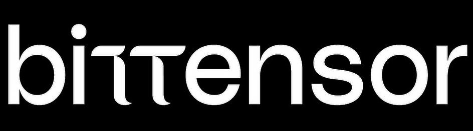

# BitAds.ai - Decentralized Marketing on Bittensor

**Revolutionizing the online marketing landscape through the power of decentralization.**
**Discover how BitAds leverages the Bittensor Network to offer cost-effective, high-quality marketing through a unique incentive mechanism for miners and validators.** <br><br>



:no_entry_sign:**The Problem:**

In 2024, the advertising industry is expected to lose over $100 billion due to ad fraud and ineffective strategies. Ad fraud, including fake clicks and bot traffic, inflates engagement metrics and wastes significant ad spend. Traditional models, like pay-per-click and pay-per-impression, often fail to deliver real value, as they don't directly correlate with actual sales, leading to wasted budgets and reduced trust. 

The rise of AI is expected to significantly increase the potential for ad fraud over the next five years by 20-30%.
This increase could lead to global losses exceeding $150 billion annually by 2028, as fraudsters use AI to generate more convincing fake clicks, impressions, and user interactions. 

:bulb:**The Solution:**

BitAds addresses these challenges by focusing on actual sales rather than clicks or impressions. With its newly implemented Conversion Tracking system on Bittensor Subnet 16, BitAds ensures advertisers only pay for successful sales, reducing fraud and guaranteeing that every dollar spent leads to real outcomes. Miners earn TAO rewards based on the sales they generate, not just traffic, driving higher-quality advertising.

:link:**Usefull Links:** <br>

- Video Presentation: [Subnet Spotlight :: SN16 :: BitAds](https://www.youtube.com/watch?v=zIIYMY-rpTw) <br>
- Overview: https://bit.ly/BitAdsOverview <br>
- Workflow: https://bit.ly/BitAdsWorkflow <br>
- Whitepaper: https://bitads.ai/whitepaper <br>
- Roadmap: https://bitads.ai/roadmap <br>
- API Docs: https://bitads.ai/api <br>
- GitHub: https://github.com/eseckft/BitAds.ai

🔨**Installation Guide:** <br>
- [Miner](https://github.com/eseckft/BitAds.ai/blob/main/docs/mining.md)
- [Validator](https://github.com/eseckft/BitAds.ai/blob/main/docs/validating.md)


# Integration with Bittensor
<p align="center">
  
</p>
BitAds leverages Bittensor’s decentralized network to distribute marketing tasks among miners, where Validators will evaluate the sales brought by miners and score them accordingly.
By harnessing the collaborative efforts of the network's participants, BitAds aims to significantly enhance the visibility and adoption of Bittensor, establishing a robust foundation for the future growth of both BitAds and Bittensor.

# Integration with Shopify
<p align="center">
  
</p>
BitAds is now fully integrated with Shopify through our BitAds app (soon to be available in the Shopify Store). This app enables detailed tracking of sales on any website where it's installed, identifying the specific miner's unique link used and the exact products purchased through it.

# The BitAds.ai Ecosystem

**BitAds.ai platform:**<br> Serves as the central hub for managing and analyzing marketing campaigns, offering essential tools for both miners and validators.<br><br>
**Validators:**<br> Use the platform to create and manage marketing campaigns, evaluating and scoring miners' tasks based on a defined scoring mechanism.<br><br>
**Miners:**<br> Promote these campaigns across the internet using their unique links and are rewarded with TAO tokens for successfully driving sales. <br><br>
**Incentive Mechanism:**<br>
Miners are incentivized with TAO tokens, not based on the client's payment offer, but on the sales they attract. This system ensures cost-effective advertising for clients while rewarding miners substantially for their efforts.
<br><br>

# How BitAds works?

1. Advertisers launch marketing campaigns on BitAds through one of the apps built on top of the platform. <br>
2. BitAds leverages the Bittensor network to distribute marketing tasks among miners. <br>
3. These miners promote campaigns across the web, driving real sales and earning TAO rewards based on their effectiveness. <br>
4. Validators then evaluate and score these efforts, ensuring transparency and fairness in the process.

# Advantages of BitAds.ai

**Decentralization** <br>
BitAds emphasizes optimal decentralization by ensuring a broad distribution of miners and validators.

**Multi-Strategy Marketing Approach** <br>
When advertisers use BitAds, they’re essentially tapping into hundreds or even thousands of different marketing strategies deployed by miners simultaneously.

**Cost-Effectiveness** <br>
By operating on low-cost systems requirements and incentivizing miners with TAO tokens, BitAds offers a highly economical marketing solution for both parties, advertisers (clients) and miners (promoters).

**High-Quality Traffic** <br>
The incentive mechanism encourages miners to drive sales and achieve high conversion rates for the products or services being promoted through marketing campaigns.

**Competitive Environment** <br>
The competitive environment fostered among miners ensures continuous innovation and optimization of marketing strategies, leading to high-quality traffic and better sales outcomes.

**Income Sources for Validators** <br>
Validators on BitAds can generate income through multiple channels, including promoting their own products, developing applications on the platform, or offering paid access to their APIs.

# Scoring Mechanism

The scoring formula for BitAds miners incorporates a thoughtful approach to quantifying the effectiveness and impact of miners based on multiple key performance indicators.

**The Main Parameters:**

**1. Total visits (TV)** <br>
This measures the total number of distinct visitors directed to the campaign via the miner's unique link. It's a direct indicator of the reach and traffic generated by the miner.

**2. Total Sales (TS)** <br>
This measures the total number of sales generated by the miner.

**3. Sales amount (SA)** <br>
This parameter will indicate the total amount of sales in fiat currency (dollars).

**4. Conversion Rate (CR)** <br>
The percentage of visitors who bought the product. 

**5. Miner Repuation (MR) ** <br>
This parameter will be based on the miner's number of sales on the last 30 days.

**6. Total Refunds (TR)** <br>
Total number of refunds occurring from specific miner.

**7. Refunds Percentage (RP)** <br>
This will indicate the percentage of buyers who asked for a refund.<br> 
```bash
( RP = TR/TS)
```

**8. Refunds Score (RS)** <br>
This value will help us penalize miners who receive too many refunds from buyers. This measure is designed to prevent score manipulation, where miners might be incentivized to purchase the products they promote and then request refunds to artificially boost their scores. <br> <br>

**Maximum Expected Values:** These are set to normalize the Main Parameters values (SA, CR and MR), ensuring they're scaled to a value between 0 and 1.
```bash
SALESmax = $500 standard (this value will be calculated based on the average amount that a miner sold in the last 30 days)
CRmax = 0.05
MRmax = 100 standard (this value will also be calculated based on the average number of sales per miner on the last 30 days)

SALESnorm = SALES / SALESmax
CRnorm = CR / CRmax
MRnorm = MR / MRmax
```
The Weights of the main parameters (SA, CR and MR). By adjusting these values we can decide on the importance of each parameter relative to the other.
```bash
Wsales = 0.60
Wcr = 0.30
Wmr = 0.10
```
**Miner Score:**
```bash
MINER SCORE = ((Wsales * SALESnorm) + (Wcr * CRnorm) + (Wmr * MRnorm)) * RF
```

**Conditions:**
- If MINER SCORE > 1 then MINER SCORE = 1
- MINER SCORE will have maximum 5 decimals

# The First Incentivized Marketing Task
<p align="center">
  
</p>
In the beginning, BitAds will work with its own Shopify store, incentivizing Bittensor miners to attract sales for Microsoft software licenses. We are also looking to collaborate with more online stores to demonstrate the network's marketing capabilities and incentivizing participation. <br>
https://keyvault.store

# FirstAds.ai - The First Web App
<p align="center">
  
</p>

The first application developed on the BitAds subnet is FirstAds. This platform enables users to create and promote their campaigns, incentivizing BitAds miners to attract sales for these campaigns at a minimal cost. <br>
https://firstads.ai

# Installation Guide

To begin using this repository, the first step is to install Bittensor. Bittensor is a prerequisite for running the scripts and tools provided here. 

You can find detailed installation instructions for Bittensor in the official documentation [here](https://docs.bittensor.com/getting-started/installation).

Please make sure to follow the installation steps carefully to ensure that Bittensor is properly set up on your system before proceeding with any other operations.

If you encounter any issues during the installation process, refer to the troubleshooting section in the Bittensor documentation or reach out to our support team for assistance.

<h3>Prerequisites:</h3>

- Ensure that you have Python 3.11 or a later version installed on your system.
- Run your local Subtensor, instructions on how to install Subtensor locally can be found
  here: [Subtensor Installation Guide](https://github.com/opentensor/subtensor/blob/main/docs/running-subtensor-locally.md)

<h3>Creating a Wallet:</h3>

Before proceeding, you'll need to create a wallet. A wallet is required for managing your digital assets and interacting with the functionalities provided by this repository.

Detailed instructions on how to create a wallet can be found in the official documentation [here](https://docs.bittensor.com/getting-started/wallets).

Please ensure that you follow the steps outlined in the documentation carefully to set up your wallet correctly.

<h3>Registration in Subnetwork:</h3>

To fully utilize the functionalities provided by this repository, it is necessary to register within the BitAds.ai Subnetwork (UID 16). 
```bash
btcli subnet register --netuid 16 --wallet.name <name> --wallet.hotkey <name>
```

<h3>After registration, you can start the scripts using the following instructions:</h3>

- [Mining](docs/mining.md)
- [Validating](docs/validating.md)

# How to Mine TAO on Subnet 16
1. Create a Bittensor wallet (coldkey & hotkey).
2. Register your hotkey to the Subnet 16.
3. Register an account to https://bitads.ai using the correct coldkey/hotkey pair of your Miner.
4. Hardware requirements:
- VPS with Ubuntu v.20 or higher
- Python v3.11 or higher
- Make sure the communication port is open
- Make sure that there is not Firewall active that would prevent the communication between your Miner and Validators.
5. Git clone the BitAds repo, install the needed packages and start your Miner’s script.
6. Login into your BitAds.ai account:
- Get your unique links from the dashboard for each active marketing campaign
- Start promoting it over the internet and try to bring sales to it


